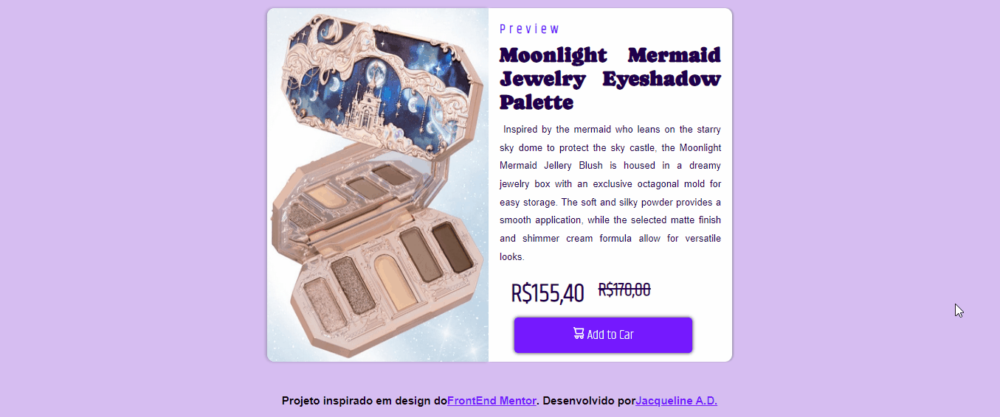
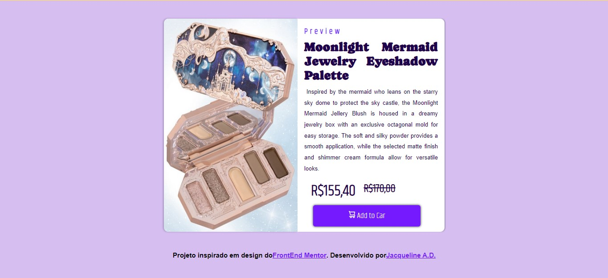

<h1 text-align="center"> Projeto de Prévia de produto </h1>

Esse projeto foi baseado em um modelo de desafio do<a href="https://www.frontendmentor.io/challenges/product-preview-card-component-GO7UmttRfa"> FrontEnd Mentor</a>. Modifiquei as imagens e cores, usando como base uma paleta de sombras da marca <a href="https://flowerknows.co/products/moonlight-mermaid-five-color-jewelry-eyeshadow-palette?variant=42972510781601">Flower Knows</a>, fundada em 2016 na China.

O projeto em si consiste em uma página com uma prévia breve do produto, junto ao seu valor, foto e botão para adicionar ao carrinho de compras. A página toda se adapta ao modelo responsivo de acordo com medidas da tela.

[]

<h1 text-align="center"> Tecnologias utilizadas </h1>

HTML e CSS

<h1 text-align="center"> Maiores dificuldades </h1>

Minha maior dificuldade foi o posicionamento da imagem ao lado da descrição sem que sobrassem rebarbas e ficassem realmente alinhadas.
Pois isso usei um conteiner, a fim de conter essa imagem em um local para depois poder movimenta-la sem causar desalinhamentos.

[]

